# xtcp

A minimal TCP implementation from scratch in C using raw sockets. Performs a complete Three-Way Handshake and transmits a text payload to a remote server, building every TCP header byte by byte.

<p align="center">
  
</p>

## Overview

**xtcp** bypasses the kernel's TCP/IP stack entirely by using `SOCK_RAW` sockets to craft and send custom TCP segments. The program:

1. Opens a raw socket directly to the network layer
2. Performs the **Three-Way Handshake** (SYN → SYN-ACK → ACK)
3. Sends a **PSH-ACK** segment carrying a text payload
4. The message appears on a remote Netcat listener, verified via **Wireshark**

### Scope

| Implemented | Not Implemented |
|---|---|
| Three-Way Handshake (SYN, SYN-ACK, ACK) | Retransmissions |
| Manual TCP Header construction | Congestion Control / Sliding Window |
| Checksum calculation (RFC 1071) | IP Fragmentation & Reassembly |
| Endianness handling (Big Endian / Little Endian) | Four-Way Teardown (FIN) |
| Data transmission via PSH-ACK | |

## Project Structure

```
xtcp/
├── src/
│   ├── main.c          # Orchestrator: handshake + data transmission
│   └── tcp_utils.c     # Core: send, receive, and checksum functions
├── include/
│   └── tcp_utils.h     # Structs (tcp_header, pseudo_header) and prototypes
├── Makefile
├── Dockerfile
└── docker-compose.yml
```

## How It Works

The project is divided into three core components, each analyzed in detail with hand-drawn diagrams.

---

### `send_tcp_segment()` — Crafting and Sending

This function builds a TCP segment from scratch and injects it into the network.

<p align="center">
  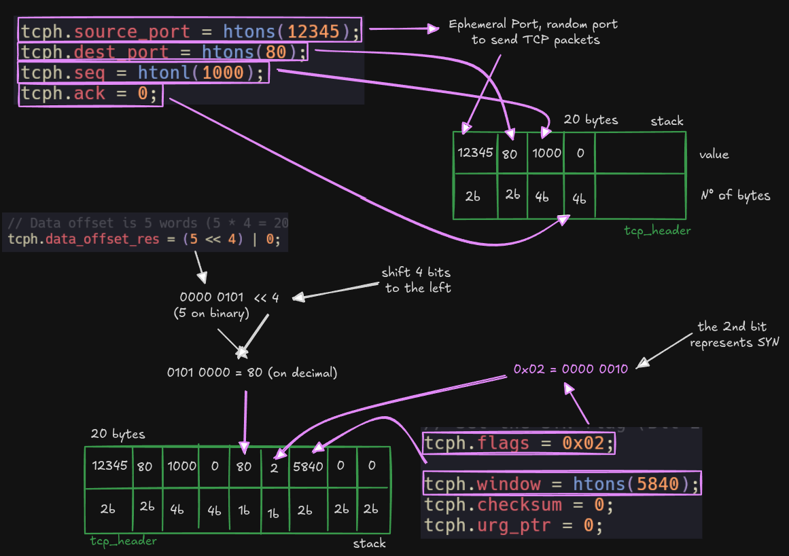
</p>

#### Step 1. Define Destination Address

Set up the `sockaddr_in` structure with the target IP and port. `htons()` converts the port from Little Endian (host) to Big Endian (network), and `inet_pton()` converts the IP string to its 32-bit binary representation.

<p align="center">
  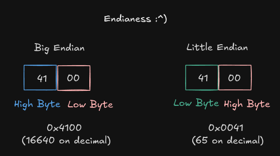
</p>

#### Step 2. Setup TCP Header

Initialize the 20-byte `tcp_header` struct field by field. The data offset `(5 << 4)` indicates 5 words (5 x 4 = 20 bytes) with no TCP options. All multi-byte fields are converted to network byte order with `htons()` / `htonl()`.

<p align="center">
  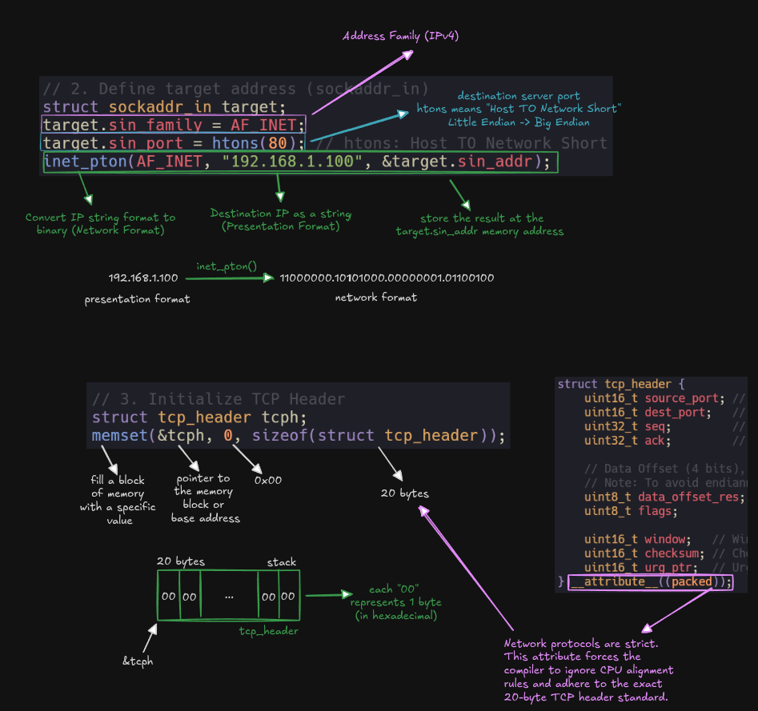
</p>

#### Step 3. Setup Pseudo-Header

The 12-byte pseudo-header is never sent over the wire. It exists only for the checksum calculation, binding the TCP segment to its IP context (source IP, destination IP, protocol, and TCP length).

<p align="center">
  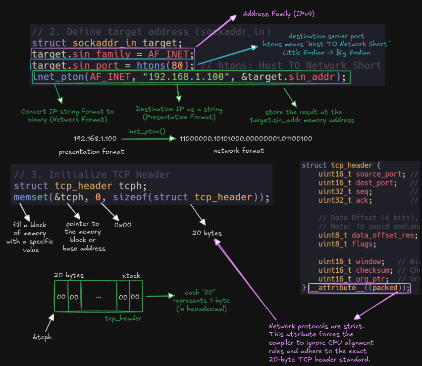
</p>

#### Step 4. Prepare Memory Block for Checksum

Allocate a contiguous memory block `[Pseudo-Header][TCP Header][Payload]` and copy all three structures into it. This pseudogram is the input for the checksum algorithm.

<p align="center">
  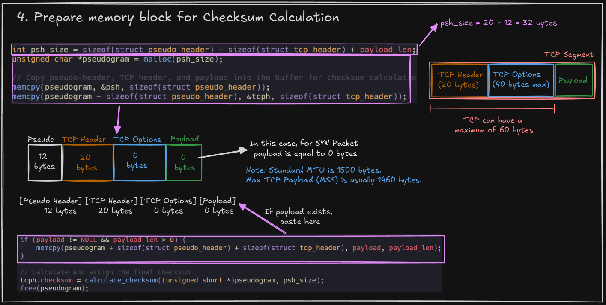
</p>

#### Calculate Checksum (RFC 1071)

The Internet Checksum algorithm: sum all 16-bit words, handle the odd byte, fold the 32-bit result down to 16 bits, and take the one's complement. This single value validates the integrity of the entire segment.

<p align="center">
  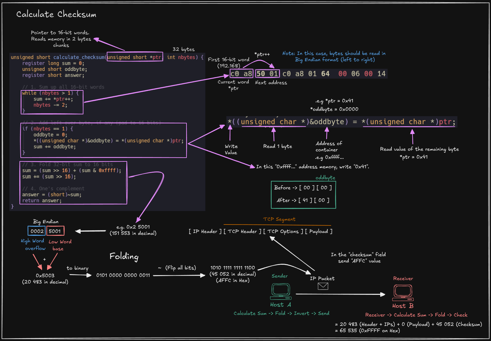
</p>

#### Step 5. Prepare the Actual Packet

Build the final on-the-wire packet `[TCP Header][Payload]` — the pseudo-header is excluded. The `NULL` check on the payload pointer prevents undefined behavior, a defensive programming pattern required by the C standard for `memcpy`.

<p align="center">
  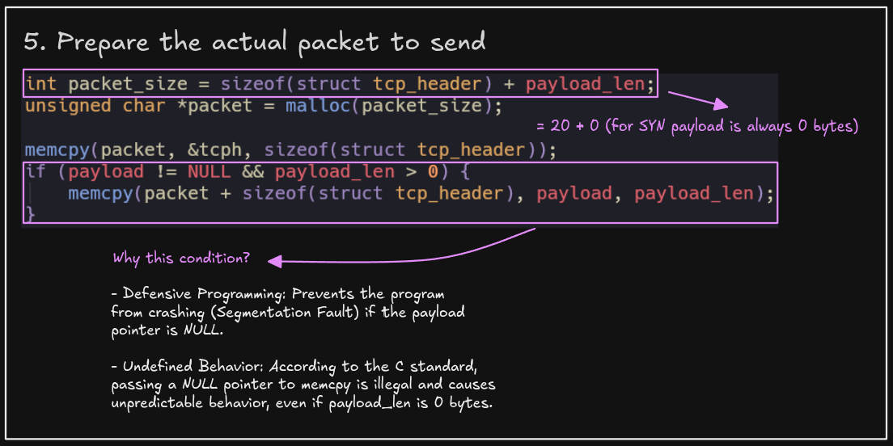
</p>

#### Step 6. Send Packet to the Network

`sendto()` triggers a mode switch from User Space to Kernel Space, injecting the raw bytes directly into the network interface toward the destination address.

<p align="center">
  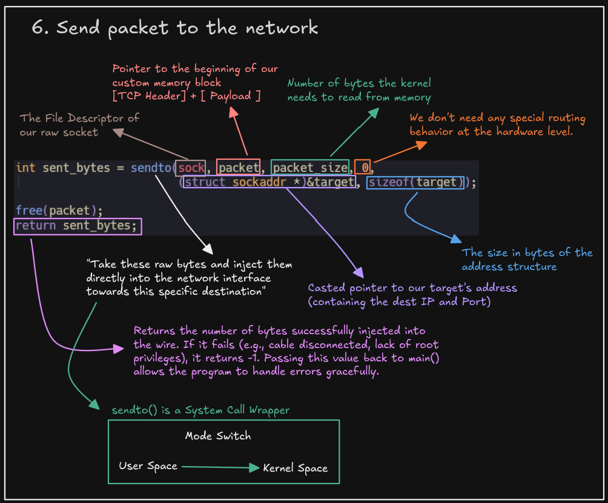
</p>

---

### `receive_tcp_segment()` — Listening and Parsing

This function captures raw packets from the network, filters them by port, and extracts the TCP control information and payload.

<p align="center">
  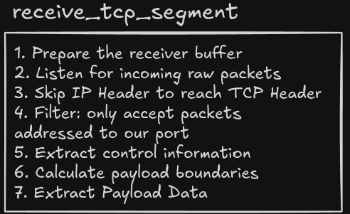
</p>

#### Steps 1-2. Prepare Buffer & Listen for Packets

`recvfrom()` blocks the thread until the kernel signals a packet arrival via hardware interrupt (IRQ). The raw socket receives the full packet: `[IP Header][TCP Header][Payload]`.

<p align="center">
  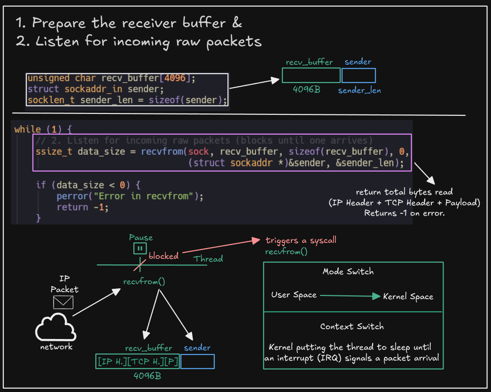
</p>

#### Steps 3-4. Skip IP Header & Filter by Port

Pointer arithmetic (`recv_buffer + 20`) bypasses the 20-byte IPv4 header, and a cast overlays our `tcp_header` struct onto the raw memory. Since raw sockets capture **all** TCP traffic, we must filter packets not destined for our port.

<p align="center">
  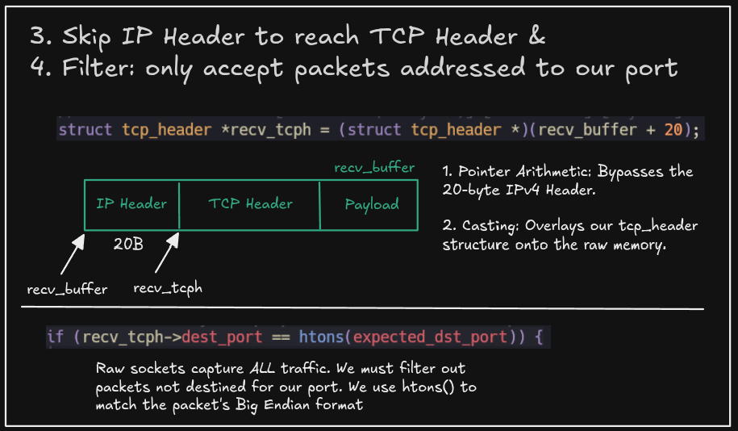
</p>

#### Steps 5-6. Extract Control Info & Calculate Boundaries

Extract flags, sequence number, and acknowledgment number (converting from Big Endian with `ntohl()`). The TCP header length is encoded in the high 4 bits of `data_offset_res` as 32-bit words — shift right by 4 and multiply by 4 to get bytes.

<p align="center">
  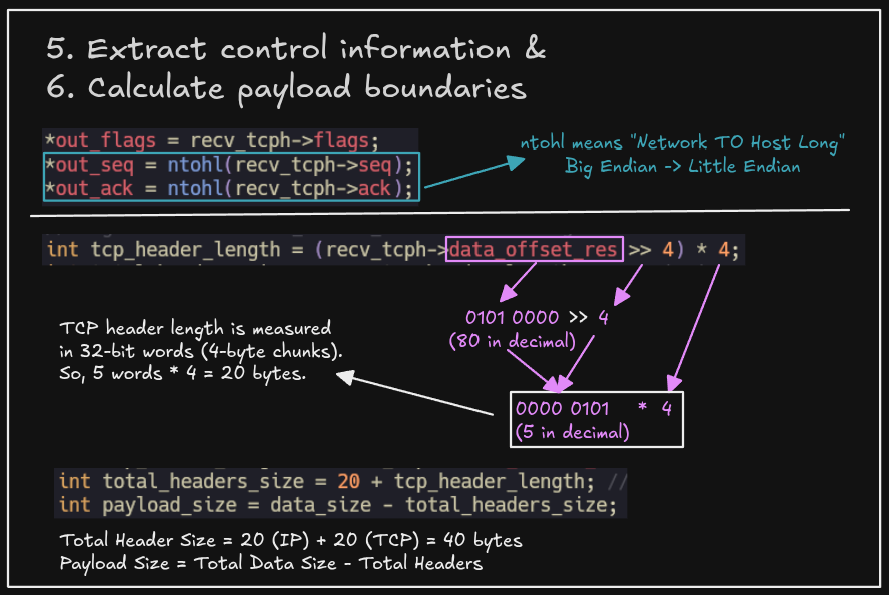
</p>

#### Step 7. Extract Payload Data

Copy the payload from the receive buffer into the output buffer and null-terminate it for safe C string handling. If no payload exists (e.g., a pure ACK), the length is set to 0 to prevent garbage memory reads.

<p align="center">
  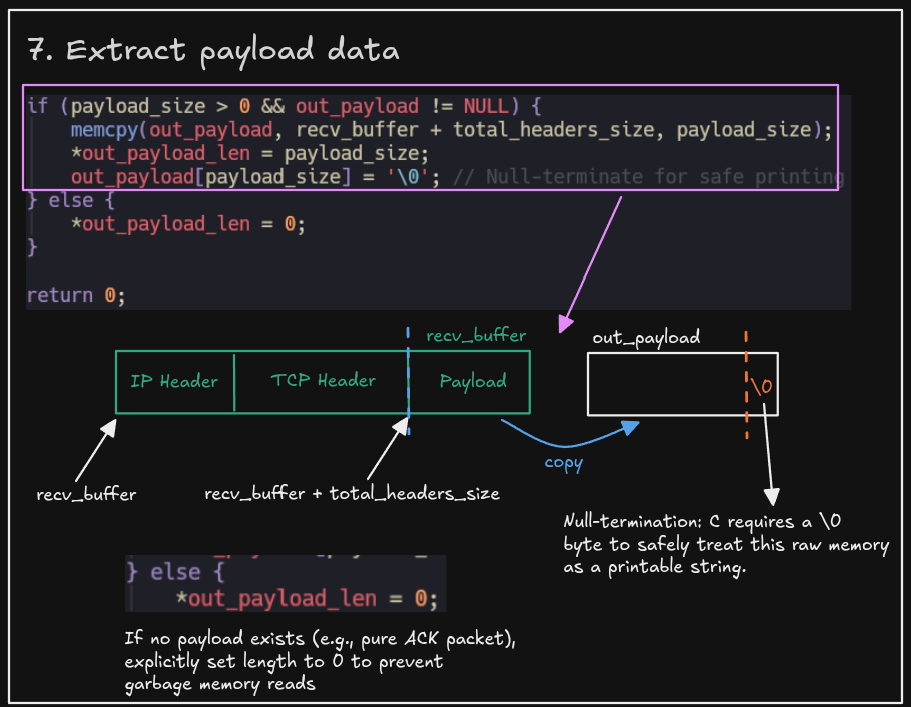
</p>

---

### `main()` — The Orchestrator

The main function ties everything together: opens a raw socket, performs the Three-Way Handshake, and transmits data.

#### Step 1. Open the Raw Socket

`socket(AF_INET, SOCK_RAW, IPPROTO_TCP)` creates a file descriptor that bypasses the kernel's TCP stack. This requires root privileges and gives us full control over the TCP header construction.

<p align="center">
  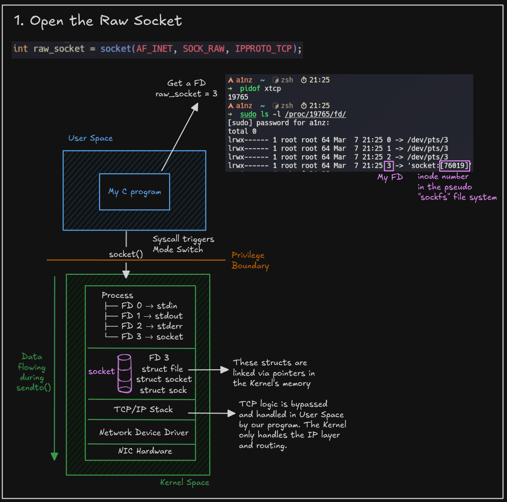
</p>

#### Steps 2-6. The Three-Way Handshake + Data Transmission

The complete connection lifecycle: SYN (seq=1000) → SYN-ACK (server responds with its ISN) → ACK (seq advances to 1001, acknowledges server ISN+1) → PSH-ACK (carries the payload `"Hello from xtcp!\n"`).

<p align="center">
  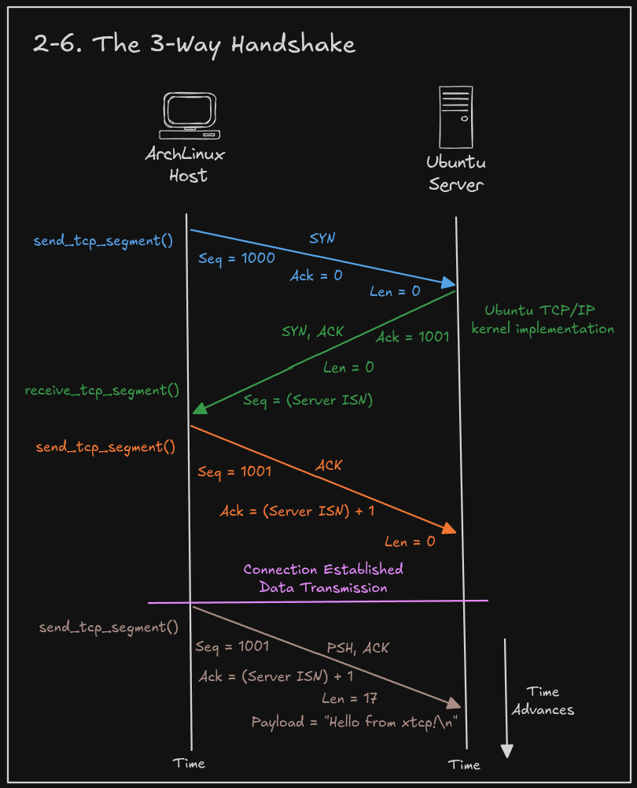
</p>

## Setup

### Prerequisites

- Linux with root access (raw sockets require `CAP_NET_RAW`)
- GCC
- A remote server to receive the connection (Ubuntu VM via [PNETLab](https://pnetlab.com/))
- [Wireshark](https://www.wireshark.org/) for packet inspection

### Build

```bash
make
```

### Suppress Kernel RST

When using raw sockets, the kernel doesn't know about our TCP connection. When it receives the SYN-ACK, it automatically sends a RST because it has no record of the handshake. This `iptables` rule blocks those outgoing RST packets:

```bash
sudo iptables -A OUTPUT -p tcp --tcp-flags RST RST -s <YOUR_SOURCE_IP> -j DROP
```

### Run

On the remote server (Ubuntu), start a Netcat listener:

```bash
nc -l -p 80
```

On your machine, run xtcp as root:

```bash
sudo ./xtcp
```

### Wireshark Filter

To isolate xtcp traffic in Wireshark:

```
tcp.port == 80 && ip.addr == <SERVER_IP>
```

## Tools Used

| Tool | Purpose |
|---|---|
| **GCC** | Compilation |
| **Wireshark** | Packet inspection and segment verification |
| **PNETLab** | Network lab hosting the Ubuntu server |
| **Netcat** | TCP listener on the remote server |
| **iptables** | Suppress kernel-generated RST packets |
| **Excalidraw** | Hand-drawn technical diagrams |

---

<p align="center">
  Made with ❤️ and C.
</p>
